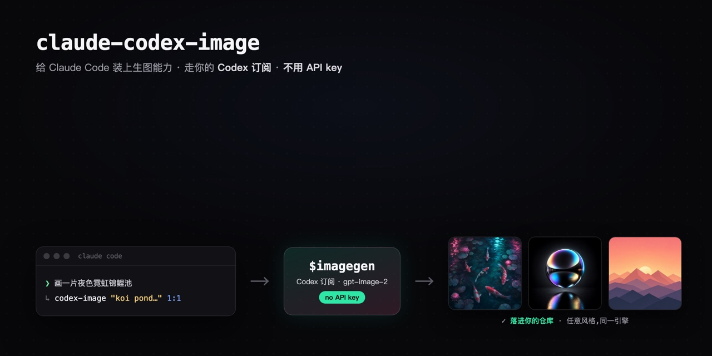

# claude-codex-image




> [English](README.en.md) · **中文**

**给 Claude Code 装上真正的生图能力 —— 走你的 Codex / ChatGPT 订阅、不用 API key —— 再配上「该生成什么」的设计品味。**

Claude Code 自己不会画图。这个套件把两半拼到一起：

1. **`codex-image`** —— *引擎*。一个很薄的封装，驱动本地 [`codex` CLI](https://github.com/openai/codex) 内置的 `$imagegen` 工具，让图片**通过你的 ChatGPT/Codex 订阅**生成 —— **不用 OpenAI API key，也没有按张计费。** 支持文生图与图生图（编辑 / 改风格）。
2. **设计品味 skills** —— *美术指导*。从 [Leonxlnx/taste-skill](https://github.com/Leonxlnx/taste-skill)（MIT）vendored 进来：反 AI 味的前端品味 + 网页/移动端逐 section 的出图指导。它们决定**该生成什么**，`codex-image` 负责**把图真正画出来**。

```
  taste / imagegen-frontend-*  ──▶  决定「生成什么」(美术指导)
            │
            ▼
        codex-image            ──▶  codex exec  ──▶  $imagegen (你的 ChatGPT 订阅)
            │                                              │
   Claude  Read  ◀────────  out.png  ◀──── 从 ~/.codex/generated_images/ 拷出
```

## 里面有什么

| Skill | 作用 |
|-------|------|
| `codex-image` | **引擎。** 用你的 Codex 订阅生成 / 编辑图片，不用 API key。*(本仓库自己的)* |
| `taste-skill`（`design-taste-frontend`） | 反 AI 味的前端品味 —— 落地页、作品集、改版。 |
| `imagegen-frontend-web` · `imagegen-frontend-mobile` | 网页 / 移动端逐 section 的设计参考出图指导（与引擎搭配）。 |
| `gpt-tasteskill`（`gpt-taste`） | Awwwards 级的 GSAP 动效 + 排版工程。 |
| `brutalist-skill` · `minimalist-skill` · `soft-skill` | 具体的美学风格方向。 |
| `redesign-skill` · `stitch-skill` · `brandkit` · `image-to-code-skill` · `output-skill` · `taste-skill-v1` | 改版审计、设计规格、品牌套件、图转代码等等。 |

> 所有设计品味 skill 均原样 vendored 自 [Leonxlnx/taste-skill](https://github.com/Leonxlnx/taste-skill)（MIT）—— 见 `THIRD_PARTY_LICENSES.md`。`codex-image` 引擎是本仓库自有实现。

## 前置条件

- [Claude Code](https://docs.claude.com/en/docs/claude-code)
- 装好 [`codex` CLI](https://github.com/openai/codex)（macOS：`brew install codex`）并登录：
  ```bash
  codex login            # 用你的 ChatGPT 订阅登录（Plus / Pro / Team）
  codex login status     # → "Logged in using ChatGPT"
  ```
- macOS 或 Linux（引擎是 bash 脚本；Windows 用户在 WSL 里跑）

## 安装

```bash
git clone https://github.com/lynlyn0215/claude-codex-image.git
cd claude-codex-image
./install.sh
```

`install.sh` 会把每个 skill 拷进 `~/.claude/skills/`、给脚本加可执行权限，并检查 `codex` 是否已装好 + 登录。可重复运行。装完**重启 Claude Code（或开个新会话）**让它加载到新 skill。

## 用法

装好后，直接用自然语言问 Claude Code：

- *「给这个落地页生成一张 OG / 社交分享图。」* → `codex-image` 出图。
- *「帮我设计一个 SaaS 落地页，并为每个 section 生成一张参考图。」* → `imagegen-frontend-web` 做指导，`codex-image` 出图。
- *「做 3 张移动端引导页。」* → `imagegen-frontend-mobile` 做指导，`codex-image` 出图。

### 直接调引擎

```bash
~/.claude/skills/codex-image/codex-image.sh "<prompt>" <输出路径> [aspect] [参考图]
```

- **aspect（比例）**：`1:1`（默认）· `16:9` · `9:16` · `4:3` · `3:4` —— OG / 社交图用 `16:9`。
- **参考图**（可选的第 4 个参数）：传一个路径 = **图生图 / 编辑**（改风格、换背景、扩图……）。

```bash
# 文生图（OG 图）
~/.claude/skills/codex-image/codex-image.sh \
  "a silver chrome mechanical keycap with a glowing starburst, near-black bg, soft rim light, no text" \
  ./og.png 16:9

# 图生图（把已有图片改风格）
~/.claude/skills/codex-image/codex-image.sh "restyle into neon cyberpunk night" ./out.png 16:9 ./input.jpg
```

成功时脚本只在 stdout 打印保存路径；失败时在 stderr 打印清楚的原因（codex 没装 / 没登录 / 额度用尽）。

## 原理（引擎）

`codex` 自带一个 `$imagegen` 图像工具。脚本用 `codex exec --json` 发一条 `$imagegen …` 的 prompt；codex 用你的订阅把图生成到 `~/.codex/generated_images/<thread-id>/ig_*.png`。脚本解析出 thread id、找到那个文件、拷到你的输出路径 —— 所以**不依赖模型「记得」去保存文件**。可用环境变量覆盖：`CODEX_BIN`、`CODEX_HOME`、`CODEX_IMAGEGEN_MODEL`（默认 `gpt-5.5`）。

## 成本与额度

不花 OpenAI API 的钱 —— 调用消耗的是你 **ChatGPT 订阅**的消息额度，并受你套餐的速率限制。别拿它刷废图；想清楚再生成。

## 致谢与许可

- **codex‑image 引擎**与打包：本仓库，MIT（见 `LICENSE`）。「用 Codex 订阅生图」这个桥接思路是社区共有的 —— 另见 [oakplank/claude-gpt-image-bridge](https://github.com/oakplank/claude-gpt-image-bridge)。
- **设计品味 skills**（`taste-skill`、`imagegen-frontend-web`、`imagegen-frontend-mobile` 等）：vendored 自 [Leonxlnx/taste-skill](https://github.com/Leonxlnx/taste-skill)，MIT —— 完整许可见 `THIRD_PARTY_LICENSES.md`。全部功劳归原作者。
- 图像生成跑在 OpenAI 的 [`codex` CLI](https://github.com/openai/codex) 和你的 ChatGPT 订阅上。
